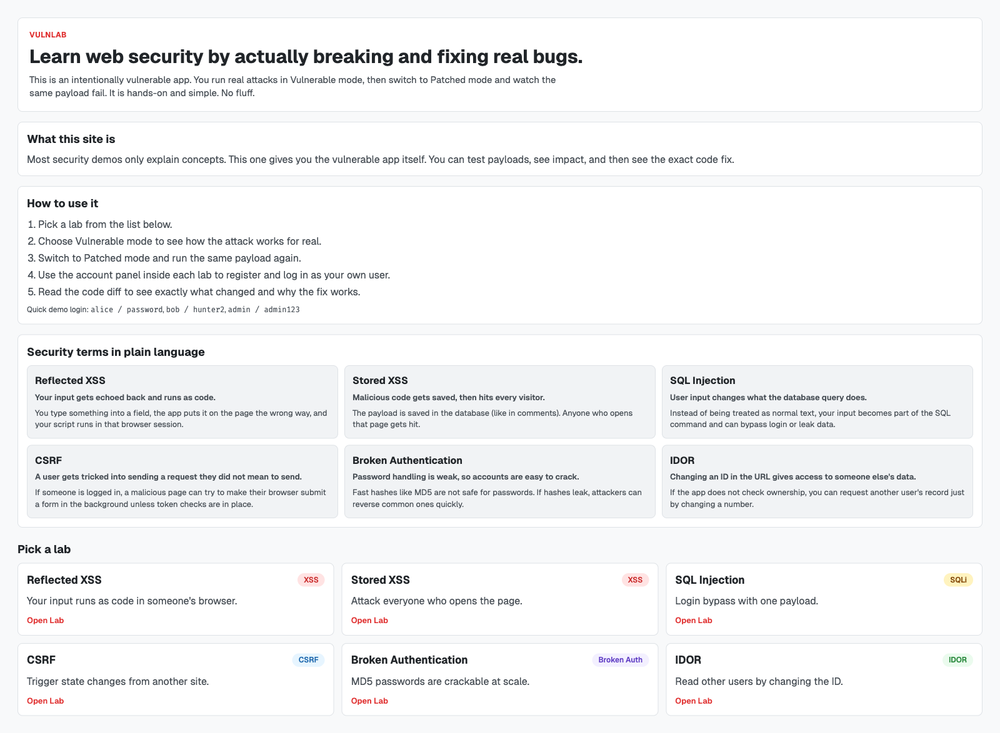
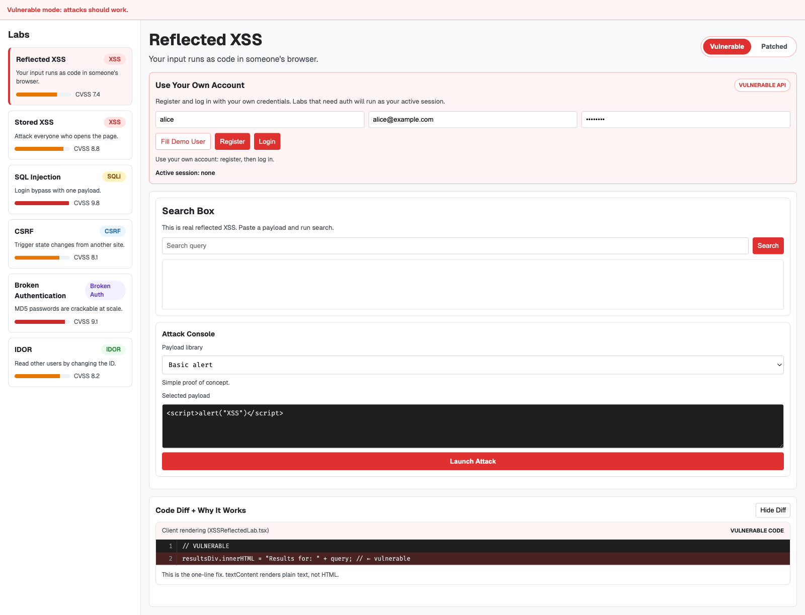
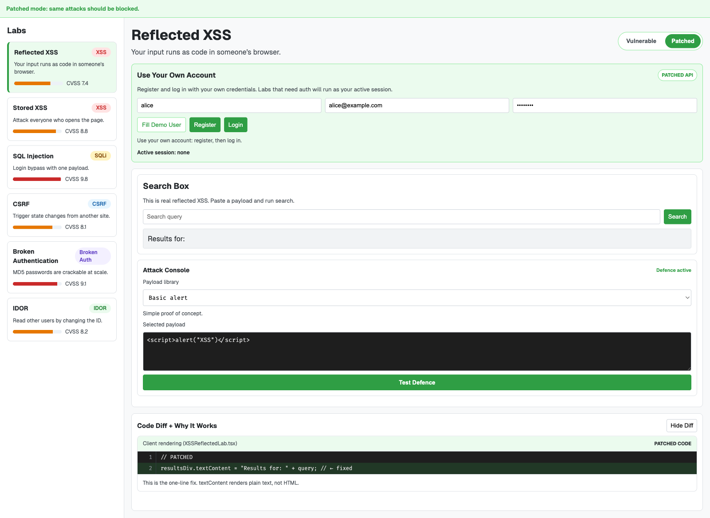
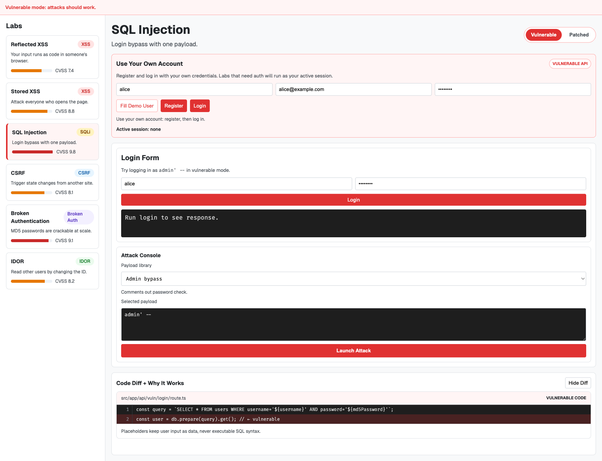
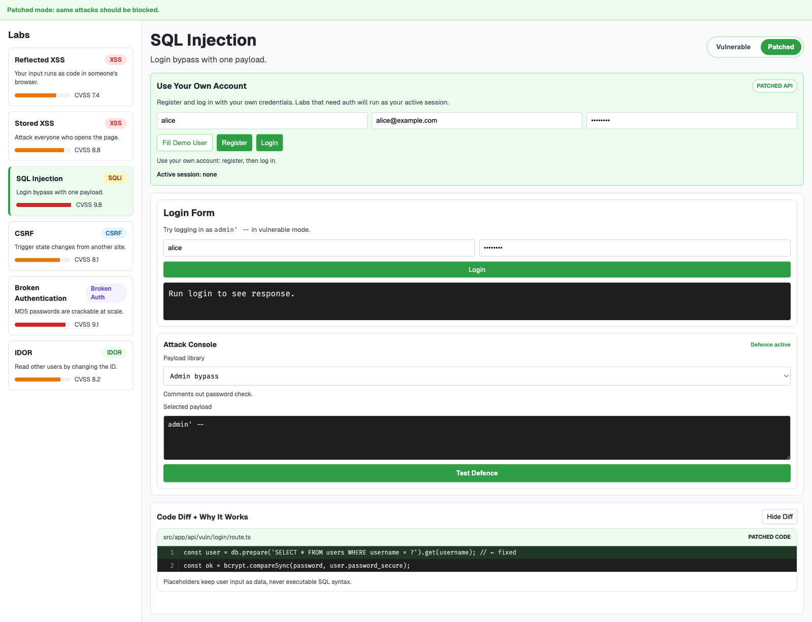
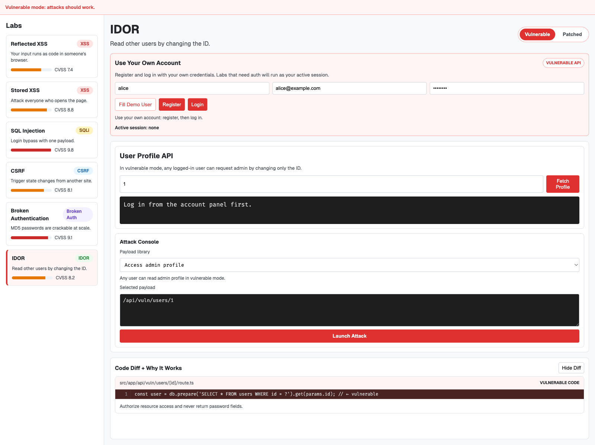
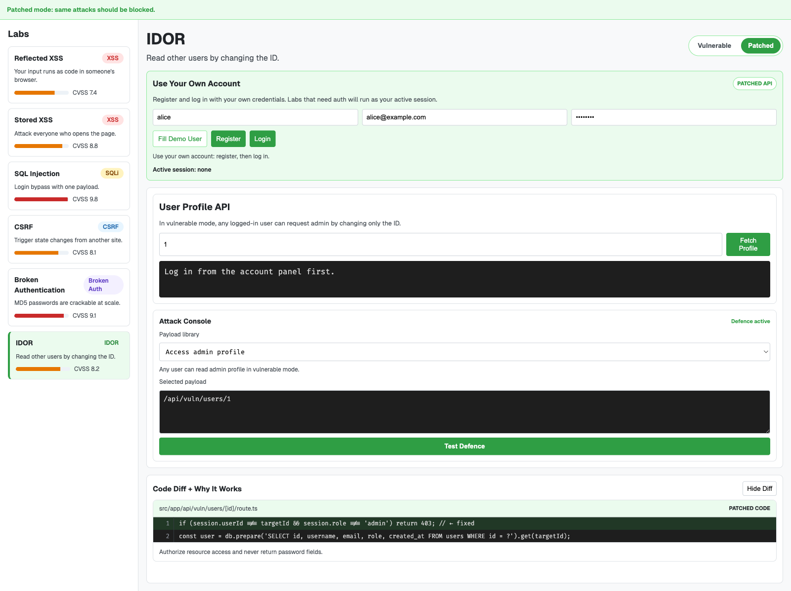

# VulnLab - Web Security Playground

Six real vulnerabilities. Attack mode and patch mode. See exactly what changes between the two.

## What it is

VulnLab is an intentionally broken web app built for learning and for showing you actually understand the attacks, not just that you've heard of them.

Each lab has a vulnerable mode where the attack works, and a patched mode where it doesn't. A code diff shows exactly what one or two lines of code change to go from broken to secure.

Labs:
- Reflected XSS
- Stored XSS
- SQL Injection
- CSRF
- Broken Authentication
- IDOR

## Run it

```bash
git clone <your-repo>
cd vulnlab
npm install
npm run seed
npm run dev
```

Open http://localhost:3000

## Test it

```bash
npm test
```

Tests intentionally verify both sides:
- vulnerable mode attacks succeed
- safe mode attacks are blocked

## Demo screenshots

```bash
npm run demo:shots
```

Screenshots are saved in `docs/screenshots/`.

### Screenshot highlights

Home:



Reflected XSS diff (vulnerable vs patched):




SQL Injection diff (vulnerable vs patched):




IDOR diff (vulnerable vs patched):




## Demo video

Generate the demo video from screenshots:

```bash
npm run demo:video
```

Or generate both screenshots and video in one go:

```bash
npm run demo:assets
```

Video output:
- [`docs/video/vulnlab-demo.mp4`](docs/video/vulnlab-demo.mp4)

## Note

This app is deliberately vulnerable in places. Do not use real user data.
